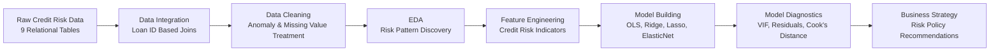
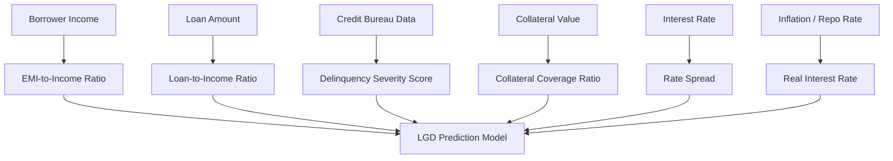

# 🏦 FinSight Bank Credit Risk Analytics & LGD Prediction Engine


---

## 📌 Executive Overview

**FinSight Bank Credit Risk Analytics & LGD Prediction Engine** is an end-to-end **Big Data Analytics and Machine Learning project** developed for a large-scale retail lending portfolio.

The project analyzes **2,000,000 loan records** to identify key drivers of **Non-Performing Assets (NPAs)** and predict **Loss Given Default (LGD)** for defaulted loan accounts.

This project is designed as an industry-oriented credit risk solution that combines data engineering, exploratory analytics, statistical modeling, machine learning, and business strategy.

---

## 🎯 Business Problem

Banks face major financial risk when borrowers default and the recovery amount is low. To reduce credit losses, financial institutions need to understand:

> Which borrower and loan characteristics increase default risk?

> Which features influence Loss Given Default?

> How can the bank improve credit policy using data-driven insights?

This project answers these questions using a structured analytics and predictive modeling pipeline.

---

## 🧠 Project Objective

The main objective is to build a reliable **Credit Risk Analytics & LGD Prediction Engine** that can help a bank improve lending decisions.

| Objective | Business Value |
|---|---|
| Identify NPA drivers | Detects risky borrower segments |
| Predict LGD percentage | Supports better loss estimation |
| Engineer credit risk features | Improves model explainability |
| Validate regression assumptions | Ensures statistical reliability |
| Compare ML models | Selects stable predictive models |
| Recommend policies | Supports safer lending decisions |

---

## 📂 Repository Deliverables

| Deliverable | Description |
|---|---|
| `FinSight_Credit_Risk_Pipeline.ipynb` | Fully executed Jupyter Notebook containing data cleaning, EDA, feature engineering, model building, and diagnostics |
| `FinSight_Executive_Summary.pdf` | Executive-level PDF report containing findings, insights, and strategic recommendations |
| `README.md` | Professional project documentation explaining the complete workflow |

---

## 🏗️ End-to-End Project Architecture



---

## 📊 Dataset Scale

| Metric | Value |
|---|---|
| Total Records | 2,000,000 |
| Data Tables | 9 |
| Primary Key | `loan_id` |
| Target Variable | `lgd_pct` |
| Default Filter | `loan_status == 1` |
| Modeling Type | Regression |
| Business Domain | Retail Lending / Credit Risk |

---

## 🧹 1. Data Cleaning & Structured Imputation

The raw dataset was distributed across multiple relational tables. These tables were merged using `loan_id` while maintaining strict row-count validation.

### Key Cleaning Activities

| Activity | Method Used |
|---|---|
| Table integration | Progressive left joins |
| Row validation | Row-count assertions |
| Anomaly tracking | Binary `dirty_flag` |
| Negative income correction | Median imputation |
| Invalid CIBIL values | Rule-based correction |
| Missing values | Median/mode imputation |
| High-missing columns | MNAR classification |
| Extreme outliers | 1st and 99th percentile winsorization |

### Data Quality Result

```text
Initial Data Size  : 2,000,000 records
Final Data Size    : 2,000,000 records
Data Loss          : 0 records
Missing Values     : Treated
Outliers           : Winsorized
Dirty Records      : Flagged and corrected
```

---

## 📈 2. Exploratory Data Analysis

The EDA stage focuses on understanding borrower behavior, portfolio risk, credit score patterns, default trends, and macroeconomic impact.

### Key EDA Insights

#### 1. Credit Score Distribution

The bank’s underwriting mainly favored borrowers with CIBIL scores between **650 and 750**.

However, there was overlap between performing and defaulted borrowers.

> This shows that credit score alone is not sufficient to predict loan loss severity.

---

#### 2. Risk-Based Pricing

The bank’s internal grade system from **A to G** showed logical pricing behavior.

| Grade | Risk Level | Pricing Pattern |
|---|---|---|
| A-B | Low Risk | Lower interest rate |
| C-E | Medium Risk | Moderate interest rate |
| F-G | High Risk | Higher interest rate |

This confirms that weaker credit grades are charged higher interest margins.

---

#### 3. Portfolio Vulnerability Areas

High-risk concentration was observed in:

- Small business loans  
- Speculative borrowing purposes  
- Borrowers with high EMI burden  
- Borrowers with recent delinquency history  
- High-risk geographic regions  

---

#### 4. Macroeconomic Shock Analysis

The project also analyzed the impact of macroeconomic events such as the **COVID-19 period** and repo rate movements.

```text
Economic Shock → Borrower Stress → Repayment Delay → Default Wave → Higher LGD
```

---

## 🧩 3. Feature Engineering

A total of **12 accountable credit risk features** were engineered and validated against `lgd_pct`.

### Feature Categories

| Category | Engineered Features |
|---|---|
| Repayment Pressure | `emi_to_income_ratio`, `loan_to_income_ratio`, `rate_spread_pct`, `real_interest_rate` |
| Bureau Behaviour | `credit_util_composite`, `enq_velocity_score`, `delinq_severity_score` |
| Asset Backing | `income_stability_ratio`, `credit_depth_score`, `collateral_coverage_ratio` |
| Transformation Features | `log_annual_income`, `log_loan_amount` |

---

## 🔍 Feature Engineering Flow



---

## 🤖 4. Regression Modeling & Machine Learning

Modeling was performed only on defaulted accounts:

```python
loan_status == 1
```

This ensures that LGD prediction is performed only where loss severity is meaningful.

---

## 🧪 Models Implemented

| Model | Purpose |
|---|---|
| OLS Regression | Baseline statistical model |
| Ridge Regression | Controls multicollinearity |
| Lasso Regression | Performs feature selection |
| ElasticNet Regression | Combines Ridge and Lasso benefits |

---

## 🛡️ Leakage Prevention

Post-default variables such as recovery fees were removed from the modeling dataset.

```text
Only pre-default borrower, loan, bureau, and macroeconomic variables were used.
```

This prevents target leakage and improves real-world model reliability.

---

## 📉 Model Diagnostics

A complete diagnostic suite was used to evaluate model assumptions and reliability.

| Diagnostic Test | Purpose |
|---|---|
| VIF Analysis | Detects multicollinearity |
| Residual Plot | Checks linearity |
| Q-Q Plot | Checks normality of residuals |
| Scale-Location Plot | Checks homoscedasticity |
| Cook's Distance | Detects influential observations |

---

## ⚙️ Model Validation Strategy

The machine learning models were tuned and validated using:

```text
GridSearchCV + 5-Fold Cross Validation
```

The **Lasso Regression model** improved interpretability by shrinking weak and unimportant variables to zero.

---

## 📊 Suggested Visualizations Included

The notebook includes industry-relevant charts such as:

- CIBIL score distribution by loan status  
- Interest rate by internal grade  
- Default rate by loan purpose  
- Geographic default concentration  
- LGD distribution plot  
- Correlation heatmap  
- EMI-to-income ratio vs LGD  
- Collateral coverage vs LGD  
- Macroeconomic timeline analysis  
- Residual diagnostic plots  
- Cook’s Distance plot  
- Model performance comparison chart  

---

## 🏛️ 5. Strategic Risk Recommendations

### ✅ 1. Enforce EMI-to-Income Ceiling

Loan applications should be reviewed or rejected if:

```text
EMI-to-Income Ratio > 45%
```

This helps prevent borrower over-leveraging.

---

### ✅ 2. Apply Higher Risk Premium for Lower Grades

Borrowers in weaker credit grades should carry additional risk pricing.

```text
Grades F and G → Additional 250 basis points
```

This compensates the bank for higher expected loss.

---

### ✅ 3. Restrict Speculative Lending Exposure

For small business and speculative loan categories:

```text
Reduce maximum LTV by 15%
Require secondary co-signer
```

---

### ✅ 4. Use Dynamic Bureau Monitoring

The engineered `delinq_severity_score` should be integrated into the credit decision system.

This helps detect borrowers showing recent repayment stress.

---

### ✅ 5. Strengthen Collateral Requirements

For high-value retail loans above ₹25 Lakhs:

```text
Minimum Collateral Coverage Ratio: 120%
```

This improves recovery confidence and reduces final write-off exposure.

---

## 🧾 Key Business Takeaways

| Business Area | Key Finding |
|---|---|
| Credit Score | Helpful but not sufficient alone |
| EMI Burden | Strong indicator of repayment stress |
| Collateral | Higher collateral reduces LGD |
| Delinquency | Recent missed payments are highly important |
| Loan Purpose | Speculative loans show higher risk |
| Macroeconomics | Economic shocks increase default waves |
| Regularization | Improves model stability and feature selection |

---

## 🛠️ Technology Stack

| Category | Tools Used |
|---|---|
| Programming Language | Python |
| Development Environment | Jupyter Notebook |
| Data Processing | Pandas, NumPy |
| Visualization | Matplotlib, Seaborn |
| Statistical Modeling | Statsmodels |
| Machine Learning | Scikit-learn |
| Validation | GridSearchCV, Cross Validation |
| Reporting | PDF Executive Summary |

---

## 📁 Recommended Folder Structure

```text
FinSight-Credit-Risk-Analytics/
│
├── README.md
├── FinSight_Credit_Risk_Pipeline.ipynb
├── FinSight_Executive_Summary.pdf
│
├── data/
│   ├── raw/
│   └── processed/
│
├── outputs/
│   ├── charts/
│   ├── diagnostics/
│   └── model_results/
│
└── reports/
    └── executive_summary/
```

---

## 🚀 How to Run the Project

### 1. Clone the Repository

```bash
git clone https://github.com/your-username/FinSight-Credit-Risk-Analytics.git
cd FinSight-Credit-Risk-Analytics
```

### 2. Install Required Libraries

```bash
pip install pandas numpy matplotlib seaborn scikit-learn statsmodels jupyter
```

### 3. Launch Jupyter Notebook

```bash
jupyter notebook
```

### 4. Run the Notebook

Open and execute:

```text
FinSight_Credit_Risk_Pipeline.ipynb
```

---

## 👨‍💻 Project Submitted By

| Detail | Information |
|---|---|
| Name | Gajendra Rathod |
| Institute | CDAC |
| Course | Big Data Analytics |
| Project Domain | Credit Risk Analytics |
| Project Title | FinSight Bank Credit Risk Analytics & LGD Prediction Engine |

---

## 🏁 Final Outcome

This project delivers an industry-oriented credit risk analytics solution that converts raw lending data into actionable risk intelligence.

The final system helps the bank:

- Detect high-risk borrower profiles  
- Understand NPA drivers  
- Predict Loss Given Default  
- Improve credit approval policies  
- Reduce future write-off exposure  
- Support data-driven lending decisions  

---

## ⭐ Project Summary

> FinSight Bank Credit Risk Analytics & LGD Prediction Engine combines Big Data Analytics, statistical modeling, machine learning, and business strategy to support smarter and safer retail lending decisions.

---
